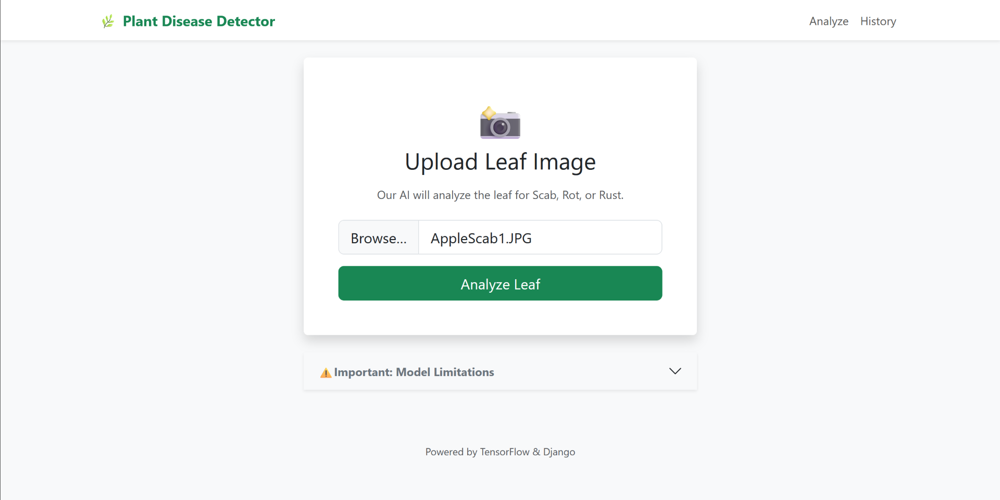
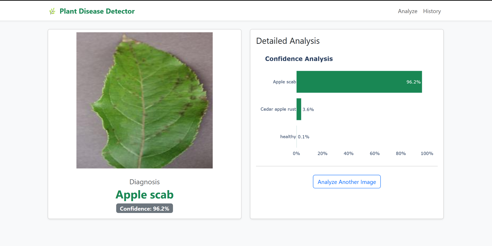
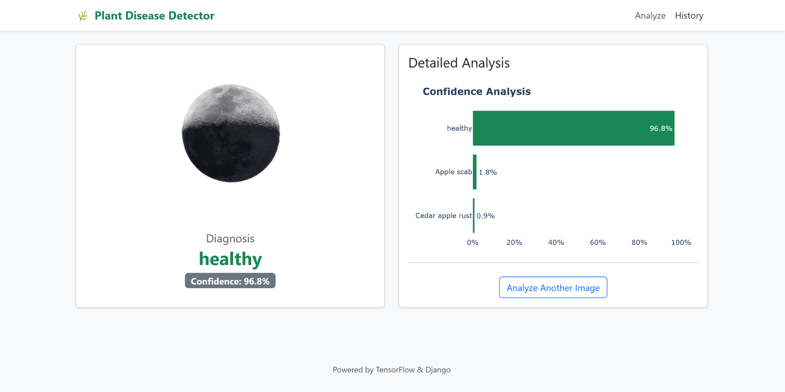
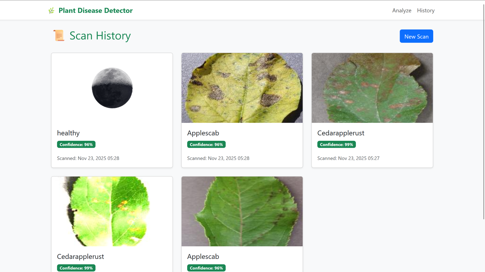

# 🌿 Apple Disease Detector

A web application built with **Django** and **TensorFlow** that detects diseases in apple leaves using deep learning. This project serves as a **Proof of Concept (PoC)** to demonstrate the integration of a Convolutional Neural Network (MobileNetV2) into a full-stack Django application.

| Apple scab input | Apple scab output |
|:---------:|:------------:|
|  |  |


| Random input | History Page |
|:---------:|:------------:|
|  |  |

---

## ⚠️ Important Disclaimers & Limitations

This is a **student/portfolio project** designed for educational purposes. Please be aware of the following technical limitations:

### 1. Limited Scope (Apple Leaves Only)
This model was trained on a specific subset of the **PlantVillage dataset** containing **only apple leaves**. It does **not** have an "Unknown" or "Background" class.
* **Result:** If you upload an image of a different plant (e.g., a tomato leaf) or a non-plant object (e.g., a cat, a car), the model will **incorrectly classify it** as one of the apple diseases with high confidence.
* **Why?** The model's final layer (Softmax) forces all predictions to sum to 100%, compelling it to choose the "closest match" even if the input is completely unrelated.

### 2. Production Readiness
This application is **not** intended for actual agricultural use. Real-world field conditions (bad lighting, blurry photos, multiple leaves in frame) may significantly affect accuracy.

---

## ✅ Recognized Classes

The model is trained to identify **only** these four specific conditions:

| Class Label | Description |
| :--- | :--- |
| **Apple Scab** | Fungal disease causing dark, scabby spots on leaves. |
| **Black Rot** | Fungal disease causing circular brown spots and fruit rot. |
| **Cedar Apple Rust** | Fungal disease appearing as bright orange/yellow spots. |
| **Healthy** | A healthy apple leaf with no visible symptoms. |

---

## ✨ Features

* **📄 Drag-and-Drop Upload:** Simple web UI for uploading leaf images.
* **🧠 Deep Learning:** Uses a **MobileNetV2** model (Transfer Learning) for efficient on-device inference.
* **📊 Confidence Scoring:** Displays the model's certainty percentage.
* **📈 Data Visualization:** Interactive bar charts using **Plotly.js**.
* **💾 Database History:** Keeps a record of previous scans and results (SQLite).

---

## 🛠️ Tech Stack

| Component | Technology |
| :--- | :--- |
| **Framework** | Django 5.0 (Python) |
| **ML Engine** | TensorFlow / Keras |
| **Base Model** | MobileNetV2 (Pre-trained on ImageNet) |
| **Frontend** | Bootstrap 5, Plotly.js |
| **Package Mgr** | `uv` (Fast Python package installer) |

---

## 🚀 Getting Started

### 1. Clone the Repository

```bash
git clone https://github.com/qtremors/plant-disease-detector.git
cd plant-disease-detector
````

### 2. Initialize Environment (using `uv`)

This project uses `uv` for fast dependency management.

```bash
# Install dependencies
uv sync
```

### 3. Setup Database

```bash
uv run python manage.py migrate
```

### 4. Run the Server

```
uv run python manage.py runserver
```

Open your browser and visit: **[http://127.0.0.1:8000/](http://127.0.0.1:8000/)**


## 🧠 Model Training Details

The model uses **Transfer Learning** with the following architecture:

1.  **Base:** MobileNetV2 (frozen weights, pre-trained on ImageNet).
2.  **Head:** GlobalAveragePooling2D → Dense (1024, ReLU) → Output Dense (4, Softmax).
3.  **Dataset:** [New Plant Diseases Dataset (Augmented)](https://www.kaggle.com/datasets/vipoooool/new-plant-diseases-dataset) sourced via `kagglehub`.
4.  **Training:** Trained for 5 epochs using the Adam optimizer (`lr=0.001`).

---
```python
# Python Script for downloading the dataset

import os
# Set your custom directory
# ⚠️ You must set this variable BEFORE importing kagglehub
os.environ["KAGGLEHUB_CACHE"] = r"Z:\datasets"

import kagglehub

# This will now download somewhere inside Z:\datasets
path = kagglehub.dataset_download("vipoooool/new-plant-diseases-dataset")

print("Path to dataset files:", path)
```

*Note: The training script `train_model.py` is included. You can download the dataset automatically using `kagglehub` to retrain the model.*